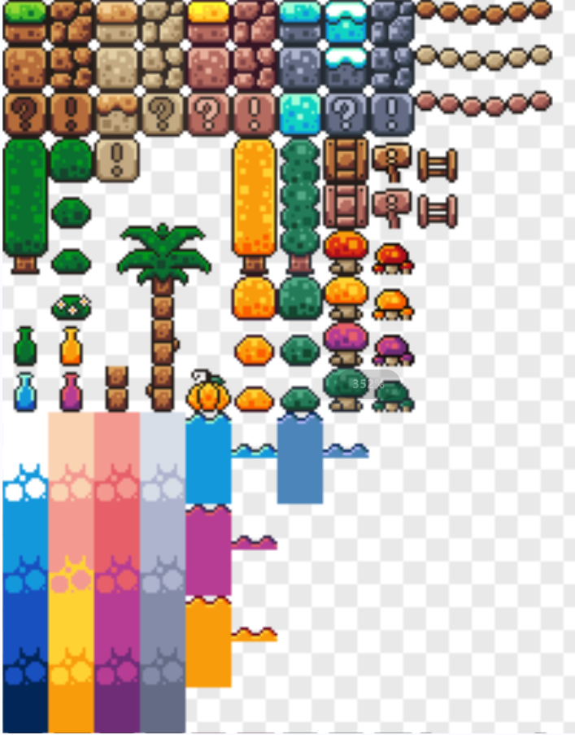
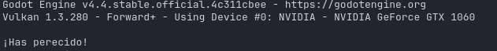
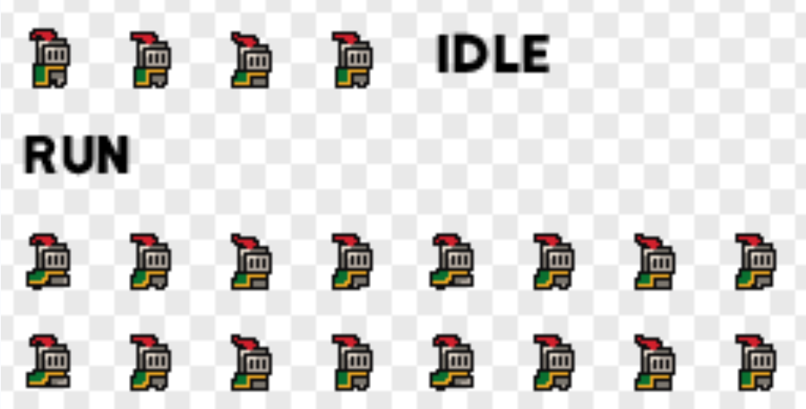
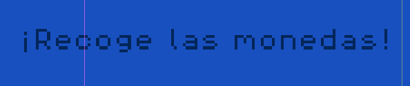
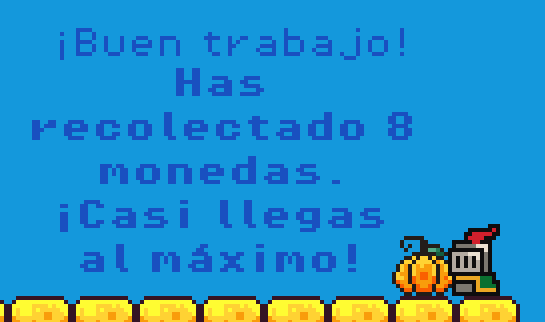
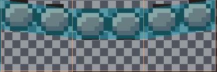

# Manual de Uso de x4, Glin.
x4, Glin consiste en un juego 2D plataformero realizado en el entorno de desarrollo de Videojeugos **Godot**.

Para que sea más fácil navegar esta documentación, dividiremos el contenido con un índice.
El índice lo he separado en carpetas dentro del proyecto.

---

## Contenidos del proyecto:
#### 1. Resumen general
#### 2. assets
#### 3. scenes
#### 4. scripts
#### 5. .godot
#### 6. Interfaz 2D
#### 7. Conclusión

***

## 1. Resumen general

Es un proyecto simple en el que se controla a un personaje a través de un pequeño mapa con la misión de recoger objetos, en este caso monedas, y hacer saltos para tanto esquivar monstruos como para no caerte y ser felicitado por un mensaje del sistema.

* Movimiento

 El movimiento es algo sencillo, se usa las flechas del teclado para mover al personaje y la tecla espacio para saltar. Las monedas se recogen al interactuar físicamente con ellas, o sea que las dos colisiones choquen entre sí.
  
* Cámara

El movimiento de la cámara es algo peculiar, ya que sigue al jugador pero con un pequeño retardo para darle ese efecto de "Realismo 2D" que se emplea en tantos juegos Scroller.

* Línea de muerte

Se encuentra en los confines del mapa para que cuando el personaje lo pise, lo devuelva al principio del nivel y se reinicie todo, como si 'hubiera perdido una vida'.

___

## 2. assets

Esta es la primera carpeta que se crea. En ella, se encuentran todos los recursos necesarios para poder trabajar con objetos, tanto audios como los Sprites. Nos podemos encontrar desde el personaje principal y los monstruos, pasando por los bloques para generar el mundo, hasta con la música que se emplea de fondo en el juego.

Vamos a adentrarnos ligeramente en cada una de las subcarpetas que forman esta:

* fonts

  Esta carpeta basta de dos archivos, que tienen una extensión _.ttf_ con la que podremos escribir nuestros textos dentro del juego. Además de darle formato de fuente a los textos, no tiene otro uso.

* music

  Considero que se sobreentiende; esta carpeta contiene el "Soundtrack", o "Banda Sonora" del juego. Como es de esperar, se encuentra en un _.mp3_, extensión de audio mundialmente conocida y, al ser un proyecto simple, no he visto menester añadir más de uno.

* sounds

  Estos son otros ficheros de audio, pero con otra extensión y otra utilidad. Dan sonido a las interacciones que pueden ocurrir dentro del juego; ya sea recolectar una moneda, recibir daño o saltar. Su extensión apropiada es _.wav_.

* sprites

  Son la base del proyecto, sin los sprites no se podría hacer un juego. Son como se ven los objetos, lo que da vida al proyecto. Podemos encontrar todo lo que podemos ver en el juego: Personajes, suelos, arbustos...

_Imagen que muestra el sprite con el que se hizo el mundo._

---

## 3. scenes

Ya aquí entramos en algo más técnico. En las escenas es donde cogemos todos nuestros recursos y los plantamos al nivel. Una escena es un objeto. Un objeto puede ser cualquier cosa, incluido el nivel en sí. 
Cada escena está compuesta por nodos, que son como las funciones o utilidades que tiene esta escena. Vamos a ver qué contiene cada archivo aquí (todos son _.tscn_).

* killzone.tscn

1. Es la línea de muerte que haces que regreses al inicio. 
2. Es un rectángulo que rodea el nivel. 
3. Si la colisión del personaje choca con la de la 'killzone', se reinicia todo el nivel. 
    1. Esto funciona gracias a la función _timer_, que es un contador en el que cada 0.6 segundos, si se cumple la condición de colisiones, reinicia el nivel.
Además, aparece en la consola de Godot que has muerto.

_Imagen que se muestra el mensaje por consola cuando muere el personaje._

* music.tscn

Meramente se encuentra la propiedad _Music_, que habilita la inserción de audios para que se pueda usar dentro del juego.

* platform.tscn

Es la escena para la plataforma que se mueve dentro del nivel. 
  1. Su colisión, a diferencia de la del jugador, es rectangular.
  2. Además, tiene la función 'Platform' activa la posibilidad de poder bajarte de la plataforma atravesándola, o sea, desactivando su colisión en un recuadro (que coincide con la colisión base).

* player.tscn
  
La característica escena del personaje jugable.
  1. Tiene la característica de _'AnimatedSprite2D'_, la cuál posibilita el movimiento fluido del personaje.
      1. Esto es, que dentro de los sprites del personaje se encuentran varios _'frames'_ del personaje para que cuando haga cualquier cosa (quedarse quieto, moverse, saltar...), tenga una _'animación'_ (cambio constante de frames).
  2. También se añaden las colisiones principales del personaje, que son las mismas que en la escena _game.tscn_.

_Imagen que muestra el conjunto de sprites que tiene el personaje principal._

* slime.tscn

  Aquí está el enemigo del personaje: el Slime. Dentro de su escena, podemos encontrarnos algún que otro nodo interesante:
1. Copia el sprite animado del personaje.
2. Añade una pequeña killzone dentro de su colisión, para cuando toque al humano, muera.
3. Añade dos nodos: RayCastLeft y RayCastRight. Estos hacen que cuando se esté moviendo el enemigo y colisione con una pared, se gire y siga su rumbo.
      1. Es una señal que manda al Script que veremos más adelante.

  
* game.tscn

**Pese a que va antes en el juego, quería dejarlo para el final por la cantidad masiva de nodos que tiene con referente hacia otras escenas.**

Ya hemos mencionado que todo lo que se ve, es un objeto, luego una escena. Esta escena es la más importante de todas, sin ella no se puede ejecutar el juego. 
Esta es con diferencia la escena más compleja y larga. Veamos sus funciones y características:
1. Maneja una etiqueta llamada _ScoreLabel_ en la que hace el recuento de cuántas monedas ha recogido el personaje al final del nivel.
2. Tiene una funcionalidad en la que se permite trabajar con los sprites del mapa. Están puestos de forma compacta para que luego se editen en el apartado 2D.
3. Tiene el nodo de la cámara que sigue al jugador con un pequeño retardo.
4. Tiene la colisión rectangular de la Killzone.
5. Tiene la referencia al _Script_ de todas las monedas. Por cada moneda, hay que crear uno nuevo, por eso hay 9.
6. Contiene las colisiones y el movimiento de las plataformas. Hay una estática al principio, y otra que se mueve horizontalmente.
7. Añade la referencia al Slime, el cuál se explica más detalladamente en su propia escena.
8. Por último, también se observan las etiquetas que hay a lo largo del camino, que se pueden editar en el panel de la derecha el texto.

_Imagen de una etiqueta dentro del juego._

---

## 4. scripts

En esta carpeta se encuentra las especificaciones de algunas mecánicas del juego para que puedan funcionar.

* coin.gd Tiene tres funciones principales a mencionar:

1. La primera de todas, _extends_, es como la herencia en java. Nos dice que se está basando en el nodo _Area2D_, o sea, que este script se **adjuntará** a un nodo de tipo _Area2D_.
2. La segunda es _@onready_, que nos indica que se inicialice la variable game_manager (otro script), nada más se haya cargado por completo la escena.
   1. game_manager está buscando al nodo Game_Manager para asignar su valor a esta variable. El símbolo _%_ es la abreviatura.
   2. $animation_player es una referencia a un **nodo hijo** llamado _AnimationPlayer_. El signo _$_ es una forma abreviada de acceder a nodos hijos dentro de la escena.
3. La siguiente función necesita para que se active chocar con el _body_ del jugador, para sumar en 1 la puntuación total que se muestra en la _ScoreLabel_, y que muestre la animación de recogida.

* game_manager.gd

1. Este código se adjuntará al nodo _Node_.
2. La función de este Script, es muy simple: cuando la función _add_point()_ suma 1, mientras que la variable previamente creada y reiniciada _var_ no supere el número 9, que son el máximo de monedas del nivel, aumenta el contador de _var_.
     1. El mensaje que saldrá al final del nivel con el recuento de monedas será igual a la condición en la que se encuentre presente la variable.
  

_Imagen de la etiqueta final, mostrando progreso en la recogida de monedas._

* killzone.gd

1. Esta script hace que si pisas la colisión rectangular, imprime por pantalla que el personaje _ha perecido_, e inicia el contador, la función que hay debajo.
    1. La función _OnTimerTimeout_ hace que cuando el contador llegue a 1 segundo, hace que la escena _game_ se vuelva a cargar, reiniciándola.

* player.gd

Esta función va a afectar al nodo _CharacterBody2D_. Tiene una gran función con varias condiciones dentro:

1. Proporciona una velocidad y fuerza de salto al personaje.
2. La variable _gravity_, principalmente recoge la gravedad fijada por el sistema de Godot y lo almacena.
3. La función _physics_process_ está compuesta de:
     1. Primero, calcula la gravedad del personaje cuando está en caída.
     2. Segundo, cuando se presiona el boton de salto, la velocidad en _'y'_ cambia a la velocidad de salto.
     3. Cuando se presiona la flecha izquierda o derecha, se cambia la dirección del personaje en la que se mueve.
     4. Hace que cuando se cambie la dirección (con la función de arriba), se gire el sprite también.
     5. Cuando el personaje cambie de estado (idle, corriendo, saltando), su sprite cambie.
     6. Aplica la velocidad al personaje al moverse.
     7. Aplica la velocidad calculada y maneja colisiones automáticamente. 
          1. Es necesario porque si no, no harían nada las colisiones.

  * slime.gd

Este Script es parecido al del jugador pero más simple.

1. Se aplica al nodo _Node2D_
2. Aplica velocidad y dirección bases.
3. Utiliza los RayCast anteriormente explicados para cuando se choque con una colisión, girar.
4. Calcula brevemente la velocidad en x.

---

## 5. .godot

No es digno de mención pero ya que existe, prefiero explicarlo brevemente. Esto es una carpeta que se encuentra en los archivos del juego, que se crea automáticamente y tiene que ver con el caché del proyecto. No he tocado nada ahí dentro y es todo automático.

***

## 6. Interfaz 2D

¿Cómo se puede editar el mapa y crear uno nuevo / añadir partes nuevas?

Es un nodo que hay en game.tscn: TileMap. Cuando seleccionamos éste, en el mapa 2D aparecerá una cuadrícula y abajo un menú de pintura.

Vamos a ver por encima cómo trabajar con él:

1. Primero hay que centrar el _grid_ para que se adecúe al tamaño de nuestros sprites cuadrados.
2. Cuando seleccionemos un bloque, al hacer click en el mapa, se pondrá automáticamente.
3. ¿Cómo se añaden colisiones? En la parte inferior se encuentran las palabras _TileSet_ y _TileMap_.
     1. Dentro de _TileSet_, podemos **pintar** las colisiones a aquellos bloques que queremos que se puedan pisar.
     2. Se pueden modificar los tamaños y las formas, para que por ejemplo el puente sea más fino.
4. Los personajes y monedas se encuentran en la layer _"Background"_. El resto del mapa, en _"Mid"_.

_Imagen que muestra la creación de colisiones para los puentes._

___

### 7. Conclusión

Este trabajo consta de las horas propuestas en la clase de Digitalización, y sólo de digitalización. Considero que para el tiempo que se impuso, la relación calidad-precio es correcta. Si llegaste hasta aquí, seguramente puedas manejarte fuidamente por Godot. 

## Muchas gracias por leer.

