# Manual de Uso de x4, Glin.
x4, Glin consiste en un juego 2D plataformero realizado en el entorno de desarrollo de Videojeugos **Godot**.

Para que sea más fácil navegar esta documentación, dividiremos el contenido con un índice.
El índice lo he separado en carpetas dentro del proyecto.

---

## Contenidos del proyecto:
#### 1. Resumen general
#### 2. assets
#### 3. scenes
#### 4. scripts
#### 5. .godot
#### 6. Interfaz 2D
#### 7. Conclusión

***

## 1. Resumen general

Es un proyecto simple en el que se controla a un personaje a través de un pequeño mapa con la misión de recoger objetos, en este caso monedas, y hacer saltos para tanto esquivar monstruos como para no caerte y ser felicitado por un mensaje del sistema.

* Movimiento

 El movimiento es algo sencillo, se usa las flechas del teclado para mover al personaje y la tecla espacio para saltar. Las monedas se recogen al interactuar físicamente con ellas, o sea que las dos colisiones choquen entre sí.
  
* Cámara

El movimiento de la cámara es algo peculiar, ya que sigue al jugador pero con un pequeño retardo para darle ese efecto de "Realismo 2D" que se emplea en tantos juegos Scroller.

* Línea de muerte

Se encuentra en los confines del mapa para que cuando el personaje lo pise, lo devuelva al principio del nivel y se reinicie todo, como si 'hubiera perdido una vida'.

___

## 2. assets

Esta es la primera carpeta que se crea. En ella, se encuentran todos los recursos necesarios para poder trabajar con objetos, tanto audios como los Sprites. Nos podemos encontrar desde el personaje principal y los monstruos, pasando por los bloques para generar el mundo, hasta con la música que se emplea de fondo en el juego.

Vamos a adentrarnos ligeramente en cada una de las subcarpetas que forman esta:

* fonts

  Esta carpeta basta de dos archivos, que tienen una extensión _.ttf_ con la que podremos escribir nuestros textos dentro del juego. Además de darle formato de fuente a los textos, no tiene otro uso.

* music

  Considero que se sobreentiende; esta carpeta contiene el "Soundtrack", o "Banda Sonora" del juego. Como es de esperar, se encuentra en un _.mp3_, extensión de audio mundialmente conocida y, al ser un proyecto simple, no he visto menester añadir más de uno.

* sounds

  Estos son otros ficheros de audio, pero con otra extensión y otra utilidad. Dan sonido a las interacciones que pueden ocurrir dentro del juego; ya sea recolectar una moneda, recibir daño o saltar. Su extensión apropiada es _.wav_.

* sprites

  Son la base del proyecto, sin los sprites no se podría hacer un juego. Son como se ven los objetos, lo que da vida al proyecto. Podemos encontrar todo lo que podemos ver en el juego: Personajes, suelos, arbustos...

_Imagen que muestra el sprite con el que se hizo el mundo._

---

## 3. scenes

Ya aquí entramos en algo más técnico. En las escenas es donde cogemos todos nuestros recursos y los plantamos al nivel. Una escena es un objeto. Un objeto puede ser cualquier cosa, incluido el nivel en sí. 
Cada escena está compuesta por nodos, que son como las funciones o utilidades que tiene esta escena. Vamos a ver qué contiene cada archivo aquí (todos son _.tscn_).

* killzone.tscn

1. Es la línea de muerte que haces que regreses al inicio. 
2. Es un rectángulo que rodea el nivel. 
3. Si la colisión del personaje choca con la de la 'killzone', se reinicia todo el nivel. 
    1. Esto funciona gracias a la función _timer_, que es un contador en el que cada 0.6 segundos, si se cumple la condición de colisiones, reinicia el nivel.
Además, aparece en la consola de Godot que has muerto.

_Imagen que se muestra el mensaje por consola cuando muere el personaje._

* music.tscn

Meramente se encuentra la propiedad _Music_, que habilita la inserción de audios para que se pueda usar dentro del juego.

* platform.tscn

Es la escena para la plataforma que se mueve dentro del nivel. 
  1. Su colisión, a diferencia de la del jugador, es rectangular.
  2. Además, tiene la función 'Platform' activa la posibilidad de poder bajarte de la plataforma atravesándola, o sea, desactivando su colisión en un recuadro (que coincide con la colisión base).

* player.tscn
  
La característica escena del personaje jugable.
  1. Tiene la característica de _'AnimatedSprite2D'_, la cuál posibilita el movimiento fluido del personaje.
      1. Esto es, que dentro de los sprites del personaje se encuentran varios _'frames'_ del personaje para que cuando haga cualquier cosa (quedarse quieto, moverse, saltar...), tenga una _'animación'_ (cambio constante de frames).
  2. También se añaden las colisiones principales del personaje, que son las mismas que en la escena _game.tscn_.

_Imagen que muestra el conjunto de sprites que tiene el personaje principal._

* slime.tscn

  Aquí está el enemigo del personaje: el Slime. Dentro de su escena, podemos encontrarnos algún que otro nodo interesante:
1. Copia el sprite animado del personaje.
2. Añade una pequeña killzone dentro de su colisión, para cuando toque al humano, muera.
3. Añade dos nodos: RayCastLeft y RayCastRight. Estos hacen que cuando se esté moviendo el enemigo y colisione con una pared, se gire y siga su rumbo.
      1. Es una señal que manda al Script que veremos más adelante.

  
* game.tscn

**Pese a que va antes en el juego, quería dejarlo para el final por la cantidad masiva de nodos que tiene con referente hacia otras escenas.**

Ya hemos mencionado que todo lo que se ve, es un objeto, luego una escena. Esta escena es la más importante de todas, sin ella no se puede ejecutar el juego. 
Esta es con diferencia la escena más compleja y larga. Veamos sus funciones y características:
1. Maneja una etiqueta llamada _ScoreLabel_ en la que hace el recuento de cuántas monedas ha recogido el personaje al final del nivel.
2. Tiene una funcionalidad en la que se permite trabajar con los sprites del mapa. Están puestos de forma compacta para que luego se editen en el apartado 2D.
3. Tiene el nodo de la cámara que sigue al jugador con un pequeño retardo.
4. Tiene la colisión rectangular de la Killzone.
5. Tiene la referencia al _Script_ de todas las monedas. Por cada moneda, hay que crear uno nuevo, por eso hay 9.
6. Contiene las colisiones y el movimiento de las plataformas. Hay una estática al principio, y otra que se mueve horizontalmente.
7. Añade la referencia al Slime, el cuál se explica más detalladamente en su propia escena.
8. Por último, también se observan las etiquetas que hay a lo largo del camino, que se pueden editar en el panel de la derecha el texto.

_Imagen de una etiqueta dentro del juego._

---

## 4. scripts

En esta carpeta se encuentra las especificaciones de algunas mecánicas del juego para que puedan funcionar.

* coin.gd Tiene tres funciones principales a mencionar:

1. La primera de todas, _extends_, es como la herencia en java. Nos dice que se está basando en el nodo _Area2D_, o sea, que este script se **adjuntará** a un nodo de tipo _Area2D_.
2. La segunda es _@onready_, que nos indica que se inicialice la variable game_manager (otro script), nada más se haya cargado por completo la escena.
   1. game_manager está buscando al nodo Game_Manager para asignar su valor a esta variable. El símbolo _%_ es la abreviatura.
   2. $animation_player es una referencia a un **nodo hijo** llamado _AnimationPlayer_. El signo _$_ es una forma abreviada de acceder a nodos hijos dentro de la escena.
3. La siguiente función necesita para que se active chocar con el _body_ del jugador, para sumar en 1 la puntuación total que se muestra en la _ScoreLabel_, y que muestre la animación de recogida.

* game_manager.gd

1. Este código se adjuntará al nodo _Node_.
2. La función de este Script, es muy simple: cuando la función _add_point()_ suma 1, mientras que la variable previamente creada y reiniciada _var_ no supere el número 9, que son el máximo de monedas del nivel, aumenta el contador de _var_.
     1. El mensaje que saldrá al final del nivel con el recuento de monedas será igual a la condición en la que se encuentre presente la variable.
  

_Imagen de la etiqueta final, mostrando progreso en la recogida de monedas._

* killzone.gd

1. Esta script hace que si pisas la colisión rectangular, imprime por pantalla que el personaje _ha perecido_, e inicia el contador, la función que hay debajo.
    1. La función _OnTimerTimeout_ hace que cuando el contador llegue a 1 segundo, hace que la escena _game_ se vuelva a cargar, reiniciándola.

* player.gd

Esta función va a afectar al nodo _CharacterBody2D_. Tiene una gran función con varias condiciones dentro:

1. Proporciona una velocidad y fuerza de salto al personaje.
2. La variable _gravity_, principalmente recoge la gravedad fijada por el sistema de Godot y lo almacena.
3. La función _physics_process_ está compuesta de:
     1. Primero, calcula la gravedad del personaje cuando está en caída.
     2. Segundo, cuando se presiona el boton de salto, la velocidad en _'y'_ cambia a la velocidad de salto.
     3. Cuando se presiona la flecha izquierda o derecha, se cambia la dirección del personaje en la que se mueve.
     4. Hace que cuando se cambie la dirección (con la función de arriba), se gire el sprite también.
     5. Cuando el personaje cambie de estado (idle, corriendo, saltando), su sprite cambie.
     6. Aplica la velocidad al personaje al moverse.
     7. Aplica la velocidad calculada y maneja colisiones automáticamente. 
          1. Es necesario porque si no, no harían nada las colisiones.

  * slime.gd

Este Script es parecido al del jugador pero más simple.

1. Se aplica al nodo _Node2D_
2. Aplica velocidad y dirección bases.
3. Utiliza los RayCast anteriormente explicados para cuando se choque con una colisión, girar.
4. Calcula brevemente la velocidad en x.

---

## 5. .godot

No es digno de mención pero ya que existe, prefiero explicarlo brevemente. Esto es una carpeta que se encuentra en los archivos del juego, que se crea automáticamente y tiene que ver con el caché del proyecto. No he tocado nada ahí dentro y es todo automático.

***

## 6. Interfaz 2D

¿Cómo se puede editar el mapa y crear uno nuevo / añadir partes nuevas?

Es un nodo que hay en game.tscn: TileMap. Cuando seleccionamos éste, en el mapa 2D aparecerá una cuadrícula y abajo un menú de pintura.

Vamos a ver por encima cómo trabajar con él:

1. Primero hay que centrar el _grid_ para que se adecúe al tamaño de nuestros sprites cuadrados.
2. Cuando seleccionemos un bloque, al hacer click en el mapa, se pondrá automáticamente.
3. ¿Cómo se añaden colisiones? En la parte inferior se encuentran las palabras _TileSet_ y _TileMap_.
     1. Dentro de _TileSet_, podemos **pintar** las colisiones a aquellos bloques que queremos que se puedan pisar.
     2. Se pueden modificar los tamaños y las formas, para que por ejemplo el puente sea más fino.
4. Los personajes y monedas se encuentran en la layer _"Background"_. El resto del mapa, en _"Mid"_.

_Imagen que muestra la creación de colisiones para los puentes._

___

### 7. Conclusión

Este trabajo consta de las horas propuestas en la clase de Digitalización, y sólo de digitalización. Considero que para el tiempo que se impuso, la relación calidad-precio es correcta. Si llegaste hasta aquí, seguramente puedas manejarte fuidamente por Godot. 

## Muchas gracias por leer.

***

# Tercera Evaluación... ¿Qué hay por contar?
En estas pocas semanas de tercera evaluación he podido alcanzar varias metas que tenía propuestas desde la última entrega. No todas lamentablemente, pero estoy satisfecho con mi trabajo.

## Veremos a continuación...

|Puntos fuertes del proyecto|
|-----------------------|
|Nuevas Escenas Visuales|
|Nuevos Enemigos|
|Nuevas acciones para el _Player_|
|Nuevos Sonidos, Nuevos Sprites|
|¡Pinchos! ..._¿Pinchos?_|
|¡Conexión Remota!|
|Conclusión|

**¡Vamos a ello!**

## Nuevas Escenas Visuales
Estas son las nuevas escenas:
  1. Menú principal 
  2. Escena de muerte 
  3. Escena de ganar
  4. Selección de mapas 
  5. **Dos niveles completamente nuevos** 
  6. Sin contar los dos niveles se incluye un **nivel tutorial**
  7. Escenas de carga de niveles para hacer transiciones 

_Pequeño disclaimer: Como en la mayoría de escenas tipo Control (Ya lo verás más adelante) es el mismo procedimiento, he duplicado bastantes veces algunas funciones para aligerar el proceso. Lo mismo ocurre con el comportamiento de los enemigos nuevos._

  ...y _creo que ya_. Vamos a adentrarnos ligeramente en cada una para ver qué contiene y que se entienda su funcionamiento. Voy a aclarar cómo se van a explicar las escenas (y todo en general):
  1. Primero, se explica lo que se ve. _Literalmente_.
  2. Después se da paso a los nodos que contiene.
  3. Por último, se define su Script y cómo influye en la escena que sea.

Una vez dicho esto, comencemos:

#### main_menu.tscn

##### Lo que se ve:

Esta es la **primera escena en pantalla nada más abrir el juego.** Primero está todo negro pero después se aclara, haciendo un _fade_in_. Además, ocurre lo mismo con la música, que **gradualmente se vuelve más fuerte junto con la claridad de la escena**. Nos aparece el menú principal con el nombre del juego en grande y tres botones que indican Tutorial, Jugar y _: - (_ (indicando la salida del juego).

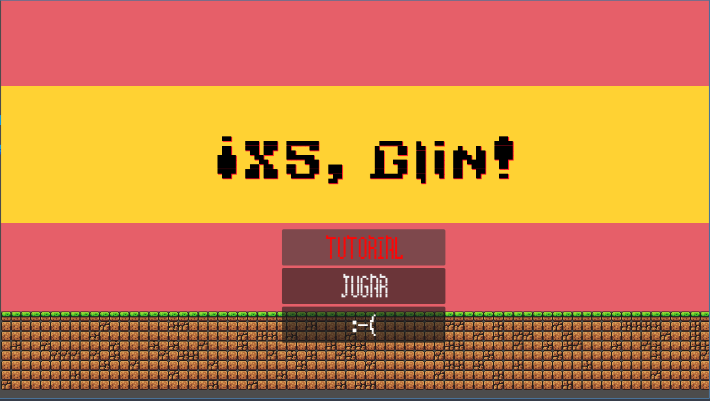

_-Imagen de referencia del menú principal_

##### Nodos:

1. Bien, ahora tocan los nodos. Como previamente he mencionado, ya estamos trabajando con un **nodo raíz tipo control**. ¿Qué es esto?
    * Un Control es un tipo de _escena_ o nodo raíz que nos indica que es una **interfaz de usuario**. Nos deja usar herramientas como botones (que es lo que principalmente uso de este nodo).

2. Después nos encontramos un VBoxContainer (Contenedor de tipo caja Vertical) para guardar nuestros botones. Su principal función es tener los botones a buen resguardo y ordenaditos, para que además los ordene como si fuera una lista, en **vertical**. De ahí su nombre. 
    * También existe la versión Horizontal que creo no haber usado porque queda muy feo.

3. Dentro del VBoxContainer está lo que realmente importan: **los botones**. Se listan 3 que coinciden con los que se muestran en pantalla: _Tutorial, Play y Quit_. El uso que se les da en esta escena (y en todas, créeme) es para acceder a distintas escenas.
    * Dentro del botón Quit hay tres nodos ya vistos:
      1. Un Sprite llamado Luigi
      2. Un AudioSreamPlayer2D para reproducir música
      3. Y un AnimationPlayer para hacer que cuando se le llame en los scripts, salgan el sprite (que está actualmente invisible) y el sonido.
          * Es meramente un pequeño susto por cerrar el juego.

4. Una label que lleva el nombre del título
    * Hay que tener ojo porque editar el orden de carga, las fuentes, su tamaño y los colores para cada caso (especialmente de los botones) es un quebradero de cabeza. Es dentro del inspector. La forma fácil es poniendo en el buscador _fonts_ y te sale rápido. Si no, es en el apartado _Theme Overrides_.

5. TileMap (Ya visto anteriormente) que incluye el TileSet básico para poder hacer el suelo ese que se ve en pantalla y el TileMap te permite pintar en distintas capas o _Layers_ para hacer niveles, pero aquí es primitivo.

6. Otro AudioStreamPlayer con un AnimationPlayer para la música de fondo o _Soundtrack_

7. Aquí sí que es interesante: El Sprite Black, que contiene el _fade_in_ previamente mencionado, pero también un _fade_out_, todo esto dentro del AnimationPlayer que tiene. El fade_in se ejecuta de forma automática nada más comienza la escena.
    * **Este nodo** es a lo que me refería, entre otros. Todas las escenas de mapas visuales contienen un black, a veces incluso un Black2. También el tema de los botones es igual en todos los mapas con botones con interacción.

8. Un _Camera2D_ que fija la cámara para que no se vea fuera de lo que hay pintado.
    * ¿Por qué he puesto eso? Verá, previamente estuve teniendo problemas de resolución, porque mi godot me ponía por defecto una resolución **mucho menor** de lo que se espera hoy en día (era como de 1152x648 o así). No sé por qué, pero es así.
    Al pasarlo a exportar tuve problemas con esto de la cámara que se veía vacío de Godot, y puse esa cámara para solucionarlo pero no me gustaba, hasta que lo arreglé.
    * Básicamente, ya es inútil, pero se ha quedado ahí. Total, tampoco molesta.

##### El Script

Es muy simple, de veras:

1. Primero, crea una variable para poder acceder a los AnimationPlayer y ejecutarlos.

2. Crea una función por cada botón, y dentro de cada uno indica que el AnimationPlayer de Black lo siguiente:
    1. Ejecuta el _fade_out_
    2. Ejecuta también el de la música (dura lo mismo)
    3. Espera con el comando _await_ a que termine de reproducirse la animación de la música
    4. Y una vez termina, cambia a la escena del botón seleccionado. Por ejemplo, si ha seleccionado el primer nivel, será game.tscn.

_No se volverá a explicar el funcionamiento de los botones a no ser que tenga algo específico porque es lo mismo en todos lados_.

Y realmente no tiene más. ¡Primera escena cubierta!

#### death.tscn

##### Lo que se ve:

Un fade_in **solo de un Black**, no de la música, cambia la label de la escena _loading_level.tscn_ pero vamos es solo lo que pone, y te aparecen **4 botones**:

|Botones|
|-----------------------|
|Regresar al menú|
|¡Mira el tutorial de nuevo!|
|Jugar nivel de las praderas|
|Jugar el nivel de las mazmorras|

Yo creo que se sobreentiende qué hace cada botón.

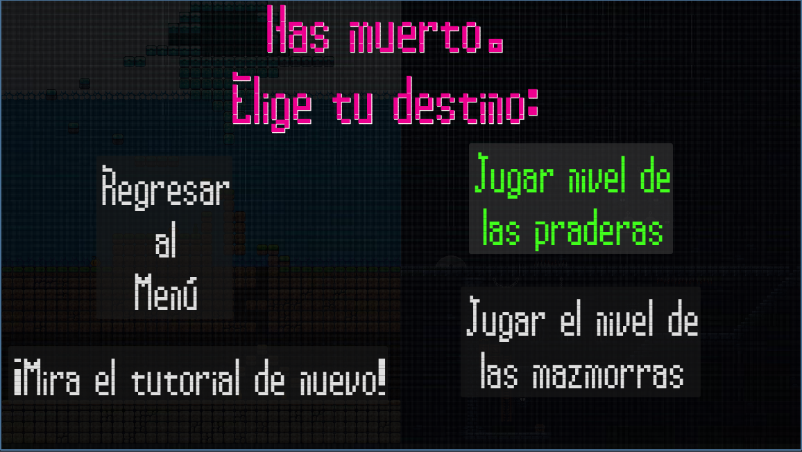

_-Imagen de referencia de lo que se ve en el juego_

##### Nodos:

**El único cambio a recalcar son las músicas del AnimationPlayer de Black**. Ahora son dos distintas y no tienen _fade_in_.

Además, se incluye otro Black de fondo pero constante para que se vean mejor los botones.

Es lo mismo que _level_select.tscn_, pero un poco cambiado. Los Scripts hacen lo mismo que el _main_menu.tscn_ pero con distintos botones.

#### win.tscn

Es exactamente igual que _death.tscn_ en comparación con _level_select.tscn_. Cambia la música, quita el fade_in de esta y cambia un poco los botones. A diferencia de _death.tscn_, quita el botón de ir al tutorial porque _**en teoría** eres bueno y te ha enterado de cómo va el tema_.

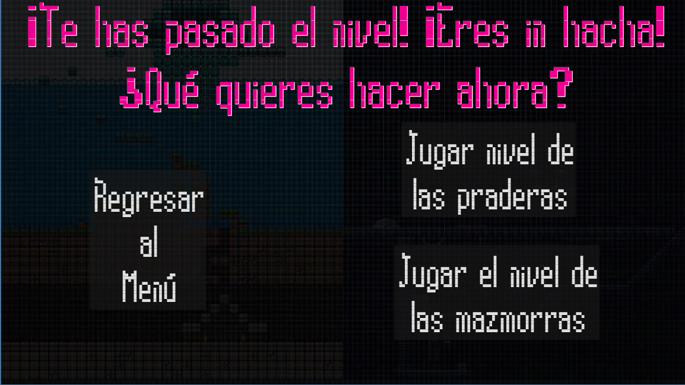

_-Imagen de referencia de lo que se ve en el juego_

#### level_select

Como previamente he dicho, es death y win .tscn pero con cambios. Quita el Black2 porque no hace falta y contiene el AudioStreamPlayer del soundtrack de nuevo. Ahora se ve el fondo (que he hecho yo y no ha sido fácil).

Los nodos y los Scripts ya se han explicado antes.

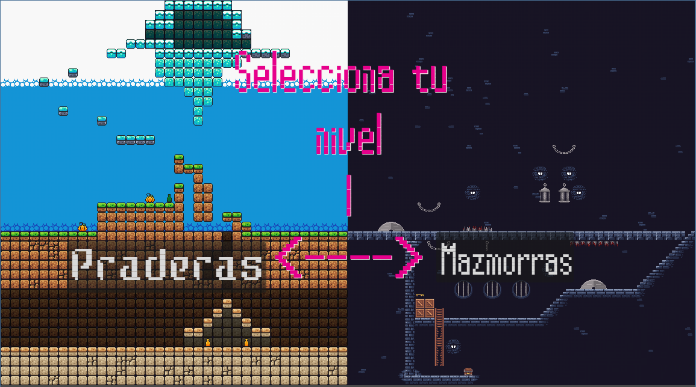

_-Imagen de referencia de lo que se ve en el juego_

#### loading_level.tscn y loading_level2.tscn

Esta escena sale por defecto al clickear en uno de los dos niveles principales. **No incluye el tutorial**.

  * ¿Por qué hay dos variantes?
      Es más sencillo en cuanto a la lógica del programa hacerlo con dos idénticos y sólo cambiando una línea; adónde lleva cuando se finalice los fade_out. **Literalmente es lo mismo.** Podría haber metido el tutorial pero eso serían 3 escenas por un mísero tutorial.

¿Qué hay de nuevo?
  1. Un pequeño sonido de como 6 segundos que reemplaza el soundtrack
  2. Un timer para cambiar de escena
  3. Un nuevo fondo de TileMap

Esta vez no hay ni siquiera botones. 

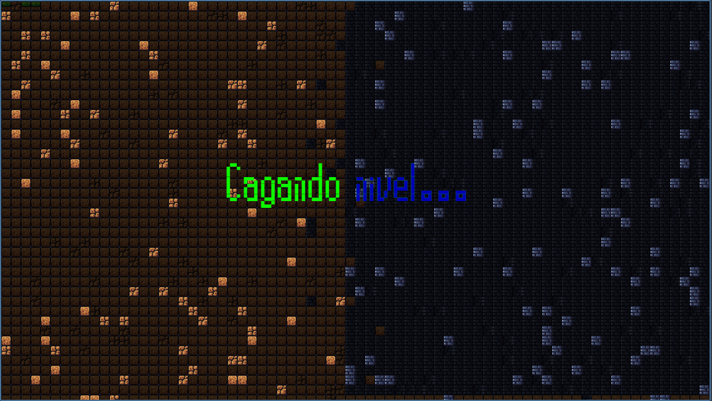

_-Imagen de referencia de lo que se ve en el juego_

**Hay algo nuevo en el script**: Trabajo con el timer. Cuando se agote el timer que se enciende nada más empiece la escena (configurable en el inspector del Timer), empieza el fade_out de siempre. 
  * ¿Por qué ahora un Timer?
      Al no tener botones ni nada a lo que agarrarse para que empiece el fade_out, he decidido hacerlo con un tiempo estándar manipulado por el Timer. No tiene más. Un pequeño croquis:
      * Empieza la escena -> Empieza el Timer -> Pasa el tiempo del Timer -> Empieza el fade_out -> Cambia de escena al terminar el fade_out.
    
#### Niveles Nuevos

Ahora sí empieza lo chungo. Probablemente sea lo más largo también.

##### tutorial.tscn

Voy a ir con este primero. Literalmente es el mismo nivel que había en la segunda entrega. No he cambiado nada, salvo:
  * Añadir algunas cosas que comparten todos los niveles que voy a detallar mejor en esos niveles. 
  * Añadir nuevos labels para explicar brevemente las nuevas funcionalidades del juego.

_Para ver el nivel detallado, volver al antiguo game.tscn. No incluye lo nuevo._

##### game.tscn

Aquí es donde empieza la magia.

##### Lo que se ve:

Comienza el nivel con el fade_in tan famoso con su soundtrack también, y te deja elegir varios caminos: Uno por abajo para ir subterráneo y otro para arriba para ir a la zona glacial. Antes de empezar a moverte uno se da cuenta de una cosa: Hay una interfaz arriba, donde se muestra **tu vida y tus monedas coleccionadas** con mensajes característicos. Cambian cada vez que te hacen daño o recoges una moneda, la verdad que he sido creativo tanto en el diseño como en las frases; todo lo he hecho yo a mano.

* Si decides subir:
  1. Te encuentras un pequeño parkour facilito y una moneda supervisada por dos slimes con un patrón un poco raro. Aquí sí o sí tienes que usar la habilidad facilitada nueva: **el roll** _(explicado más adelante)_. 
      * Arriba la verdad que no hay mucho contenido por eso lo he puesto antes.

* Si decides bajar:
  1. Hay un parkour realmente complicado si no te haces a las físicas del salto y movimiento del personaje
  2. Hay una plataforma que te lleva a una moneda resguardada por un slime en un sitio muy cerrado, muy complicado de pasar sin recibir daño
  3. Hay **Dos secretos escondidos**; uno es una moneda que es saltando hacia la izquierda como un poseso desde arriba y el otro secreto me lo guardo para más adelante. _Un pequeño incentivo._
      * No te preocupes que te devuelve arriba una plataforma, no te mueres
   
Con todo esto ya deberías tener las suficientes monedas para pasarte el nivel, ¡felicidades! Pero, ¿y el secreto?

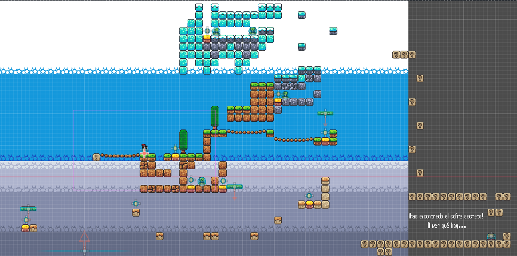

_-Imagen de la escena game.tscn vista desde lejos_

##### Secreto secretito

Si bajas, y tras pasarte el parkour y llegar a la plataforma saltas hacia la derecha, la gente pensará que es un suicidio porque no hay nada. Pero, he bajado un poco la _killzone_ y he puesto **bloques invisibles** para que, yendo hacia la derecha se vea una zona fuera del mapa secreta, con una label **y un cofre con animación**. 
  * Esto requiere mucho trabajo de hacer sobre todo porque sólo lo he hecho exclusivamente para esto.
    1. Al tocar el cofre inicia la animación opening y se revela una imagen poco a poco haciendo un fade_in.
    2. Mientras esto ocurre, **el label va cambiando su texto**
    3. Al terminar la animación _opening_, empieza _closing_ que es lo mismo pero al revés.
    4. Aquí está el truco: Para que no se reinicie cada vez que hace contacto el jugador con el cofre, al tocarlo y empiece la escena _opening_, ésta incluye la desaparición de la colisión (igual que en las monedas).
    5. Al terminarse _closing_, el objeto _chest_ se elimina, pero se queda el sprite porque he dibujado el tile del cofre justo debajo para que parezca una ilusión (da problemas lo de la colisión)
    6. En teoría, el cofre debería de tener un sonido por cada frame de animación pero no sale y no sé por qué, porque está bien puesto en el AnimationLayer. Por falta de tiempo, lo dejé así.

##### Nodos:

Empezamos con CanvasLayer. Esto es la interfaz que sale arriba. En el tutorial está también pero no tiene TileMap porque **quería que fuese único por nivel**.

El CanvasLayer es básicamente lo que te sale sí o sí, _pegado en la pantalla_. **Puedes poner lo que sea**. En mi caso, Incluye:

  1. El Black de siempre
  2. GameManager. Es un _nodo carpeta_ como lo llamo yo, que no tiene utilidad sino para guardar otros nodos dentro. Contiene:
      * La label notifDmg y ScoreLabel que es el texto que sale arriba de las vidas (notifDmg) y las monedas (ScoreLabel).
      * Timer que engloba al Black2 con su AnimationPlayer. El Timer está puesto de tal forma que cuando la vida llegue a 0, empiece el contador **para que salga la animación de la muerte**, mientras hace el fade_out y lleve a la escena _death.tscn_.
      * El TileMap con el que hago los visuales de las cajas de las labels de arriba
  3. El TileMap normal del nivel
      * Contiene el TileSet de otra descarga para poder meter el cofre, y otro sobrante que era con el que iba a usar el cofre pero era más _pocho_.

Ahora van a salir los mismos nodos que hay en el tutorial, pero a lo mejor incluyen más cantidad pero es lo mismo (menos en las plataformas que me pararé a explicarlo un poco):
    1. Nodo Player con su cámara, igual que siempre
    2. Nodo de área Killzone para que mate al bajar a X altura
    3. Las monedas, mismo número y funcionalidad
    4. Plataformas. Está la estática que es la misma que el tutorial pero hay 2 que se mueven: La de la izquierda del todo de la moneda oculta y la de después del parkour de abajo.
    5. Slimes, hay 3 nuevos slimes con el mismo código y todo que el tutorial, pero con un cambio un poco raro que me gustó y lo dejé así
      * Si metes a un Slime como hijo de otro slime, cada vez que colisiona con algo es como si se esperase en vez de cambiar de dirección directamente. Me gusta por el aumento de dificultad a la hora de encontrar patrones así que lo dejé así.
      * La diferencia es en el AnimationPlayer, que tienes que poner **de forma clara y concisa** la posición de la plataforma. Si no, se _bugea_ de forma vasta y se va al _punto (0.0)_, si es que no la tenías puesta ya en algún sitio.
        * Digo esto sobre todo por el tema de la duplicación o cambio de ideas, es muy frustrante.
    6. Las mismas labels que habían antes pero cambiadas de sitio y de texto

Ya a partir de aquí no es lo mismo que en el tutorial.

  * El AudioStreamPlayer del soundtrack, utilizado por todos los niveles
  * La imagen del secreto y la animación de su fade_in y del label que tiene a su izquierda.

##### El Script

Como tal no existe un Script llamado _game.gd_, ni de tutorial ni del otro nivel. **Todos se basan en uno genérico que es el que maneja todo el tema de la vida y las monedas: game_manager.gd**

1. Primero, genera las variables de vida y de puntuación. Actualmente hay dos variables que no se están utilizando: **max_score** y **lives**. 
    * Ésta última es un intento de hacer que el jugador tuviese vidas como en Super Mario, intentos de pasar el nivel pero se complicaba demasiado.

2. Una vez declaradas, cogemos **los valores de los labels del CanvasLayer** para que se puedan editar al cambiar el valor de vida o moneda.

3. La función _add_point()_ es la misma que había en la entrega anterior: Recoge una moneda, se actualiza la variable _score_ y la variable de texto _score_label_ se actualiza dependiendo de cuánto valga _score_. Si llega al máximo (9), hace el _fade_out_ _into_ la escena _win.tscn_.
    * Lo mismo ocurre con la función rem_hp(), pero en vez de con monedas es activando la señal _body_entered_ dentro del Script de _Player.gd_. Lo revisamos luego pero quédate con eso; si se activa el choque de colisiones _player-enemigo_, quita 1.

4. La función _on_timer_timeout() es la misma que en tutorial. Cuando se pasa el timer, va a la escena _death.tscn_. Se activa nada más la vida sea igual a 0 (el timer, digo).

Con esto finaliza _game.tscn_ ¡No te preocupes! Lo siguiente es más liviano porque es casi lo mismo.

##### game2.tscn

##### Lo que se ve:
Aquí está lo divertido. Es lo mismo que el primer nivel pero visto de otra forma y con mentalidad más de supervivencia. **Es difícil.** Pasillos estrechos y muy largos lleno de bichos y trampas, parkour que no es tan sencillo y si _bajas de planta_, no puede volver, así que asegúrate de recoger todas las monedas de esa planta antes de bajar.
  * Todo esto lo indico al principio, no te alteres.
  * La cámara del player he tenido que ponerla más lejor para aumentar la visión del jugador porque si no de verdad te lo digo que era imposible.
  * También cambia la música; tiene un soundtrack único. 
  * También el TileMap es completamente distinto; está mucho más oscuro todo.

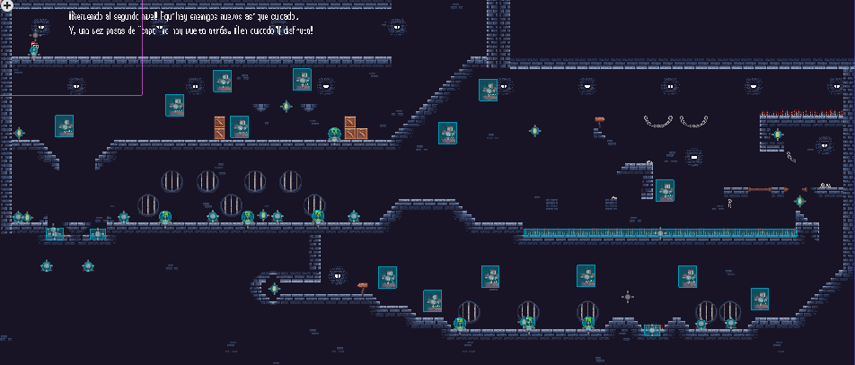

_-Imagen de la escena game2.tscn vista desde lejos_

##### Nodos:
  Es exactamente lo mismo que en el nivel de las praderas, pero con nuevos enemigos y los infames **pinchos**. Ya se explicará más adelante.

El Script se comparte entre todos los niveles. ¿Ves como era más corto?

Con esto se finaliza todas las escenas visuales. _¡Viva!_

---

## Nuevos enemigos
  En el segundo nivel _(Se llama Mazmorras)_, se puede encontrar 2 nuevos enemigos: "Bicho" (Es un ente volador que va más rápido _yendo de ida que de vuelta_), y **Slime II**, que es un Slime morado con una **animación completamente nueva**, más lento para hacer el _parkour_ más difícil. Vamos a detallarlo un poquito más:

#### Slime II

* Es un slime que sinceramente se ve mucho mejor que el otro, _más realista_ diría yo, con hasta 4 frames de animación. El Slime original tenía como mucho 2.

* Además, tiene un tono morado que lo hace un poco complicado verlo en un nivel tan **oscuro**.

* Dentro de su Script es lo mismo que el Slime original pero cambiando su constante de velocidad, de 60 a 30. 
  * Hombre, algo tiene que cambiar, ¿no? Si no, no es un enemigo nuevo.

**En resumen:**
1. Mismo comportamiento
2. Más lento
3. Morado
4. Nueva animación

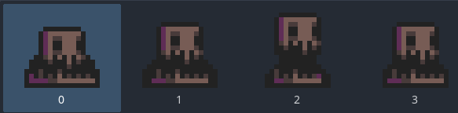

_-Imagen de la animación de Slime II_

#### Bicho
Le puse ese nombre porque sinceramente no sabía lo que era, estaba chulo y quería meterlo.

Tiene el mismo comportamiento izquierda -> giro -> derecha que el slime, pero va muy rápido yendo hacia un lado más que para el otro. No tiene más. Dentro de su script se ve esto:

>if ray_cast_right.is_colliding():
>>		direction = -1
>>    SPEED = 100
>>		animated_sprite.flip_h = true

>if ray_cast_left.is_colliding():
>>		direction = 1
>>		SPEED = 60
>>		animated_sprite.flip_h = false

_el cambio de velocidad es cuando cambia de dirección._

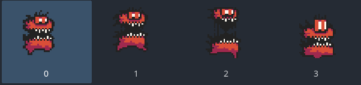

_-Imagen de la animación de Bicho_

Ya podemos pasar al mayor dolor de cabeza que me ha podido pasar en este proyecto: **Player.gd.**

---

## Nuevas acciones para el personaje

**El personaje se ve exactamente igual.** Los únicos cambios son en sus animaciones para poder permitir hacer **rolls** y **death**, _y el intento de **hurt** que no salió y es lo que más horas le he pegado de este Script_, y el Script para que funcionase. Vamos a ello:

#### Animaciones nuevas:
**Suponiendo que tienes ya un _Grid_ de tu personaje (donde incluye todo lo que pueda hacer) ya metido en tus assets, voy a hacer un tutorial de cómo añadir una nueva animación:

|¿Cómo añado una nueva animación a mi personaje?|
|-----------------------|
|En Player.gd, selecciona el nodo AnimatedSprite2D. Si no lo tienes, crea uno nuevo. _(ctrl + a)_|
|Aparecerá un menú abajo. Presiona _ctrl + n_ o vete donde pone Animaciones: y justo debajo al papel con el _+_ verde.|
|Más a la derecha del papel busca un icono que es un cuadrado 3x3.|
|Selecciona tu Player Grid donde sea que lo hayas guardado.|
|Ajusta el tamaño arriba a la derecha para que quepan todos (o los que vayas a utilizar) en una cajita.|
|Cada cajita es un frame. Selecciónalos en orden y tienes tu animación. ¡Felicidades!|
|Recomendación: Cámbiale el nombre a cada animación para que te sea más fácil escribirlo en código.|

Ya que tenemos nuestra nueva animación, vamos a ver el código nuevo:

#### Funciones nuevas

##### Animación roll

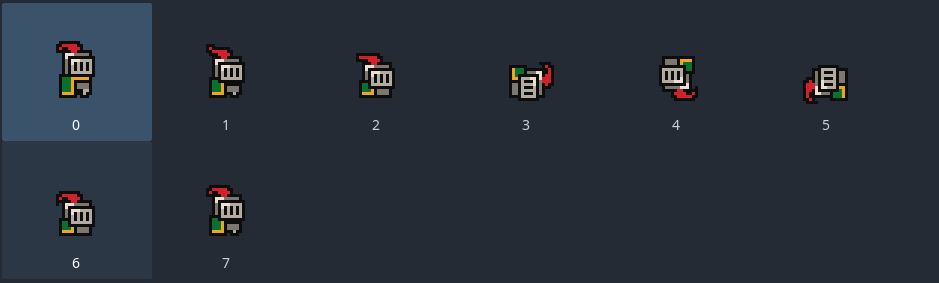

_-Imagen de la animación de roll_

* Se añaden constantes para declarar el ruedo tal que así:
~~~
var is_rolling = false
var roll_timer = 0.5  # segundos
var roll_duration = 0.5
var roll_speed = 220
~~~

  * Al principio es falso porque no se está rodando.
  * Dura 0.5 segundos
  * Es la duración máxima para compararlo con el Timer
  * La velocidad que tiene el roll

Ahora vienen dos funciones que no son funciones como tal, pero tienen tanto código detrás de un simple if que se considera una prácticamente.

* Función para activar is_rolling

>if Input.is_action_just_pressed("roll") and is_on_floor() and velocity.x != 0:
>>		is_rolling = true
>>		roll_timer = roll_duration
>>		collision_layer = 1  # Desactivar las colisiones durante el roll
>>		collision_mask = 1
>>		return

  1. Primero, asegura que el botón asignado para _roll_ (en este caso el _SHIFT_), sea justamente presionado, que esté en el suelo y que se esté moviendo para hacer un roll. 
      * No tiene sentido hacer un roll en el aire o quieto.
      * El botón se asigna en Proyecto(Arriba derecha) -> Configuración -> Mapa de entrada.
  2. Si se cumplen estas condiciones, se le asigna **true** al is_rolling
  3. Le asigna el valor de duración máxima al timer porque no estamos trabajando con ningún timer, sino con **delta**.
    * _delta_ es el tiempo elapsado desde el último frame. O sea, si le restamos al 0.5 delta, es como si fuese un timer porque va frame por frame.
  4. Cambia la layer en la que se encuentra el player. Esto es **crucial** si queremos que sirva de algo el roll.
    * Básicamente, el layer de la colisión de los enemigos está diseñado para que pueda chocarse con la del player: la 2. Si la cambiamos a 1, no tiene capacidad de tocar al player.
  5. Por último, devuelve todos los valores para que se puedan usar.

Una vez activado is_rolling, se activa la siguiente _función:_

* Función is_rolling
>if is_rolling:
>>		animated_sprite.play("roll")
>>		roll_timer -= delta
>>		if roll_timer <= 0:
>>			is_rolling = false
>>		collision_layer = 1  # Desactivar las colisiones durante el roll
>>		collision_mask = 1
>>		move_and_slide()  # Asegurarse de mover al personaje
>>		return

Entendiendo cómo funciona el código anterior este es más fácil:

1. Mientras que is_rolling sea _true_, se inicia la animación _roll_
2. Resta delta al roll_timer
3. Si el valor del timer es menor o igual a 0, cambia el estado del is_rolling a falso
4. Vuelvo a poner lo de el cambio de layer como método de seguridad para que sí o sí lo cambie
5. move_and_slide() permite el movimiento otra vez del personaje de forma normal
6. y lo devuelve.

* Las colisiones se reinician al comenzar la función principal gracias a esto:
>collision_layer = 2
	collision_mask = 1

Se puede encontrar al principio de la función.

##### Animación death

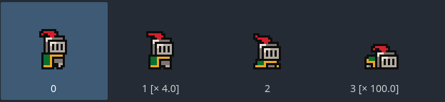

_-Imagen de la animación de death_

* Cabe mencionar que he tenido que estar varios minutos configurando los frames que toma cada frame de esta animación para que quede _chula_ y no se acabe en 0.3 segundos.

Se declara el booleano para saber si está muerto o no:
> var is_dead = false

En el comienzo de la función principal, se declara lo siguiente:

>if is_dead:
>>return

Esto lo que hace es que se ejecute cada vez al principio del código, y si es verdadero que devuelva siempre lo mismo; nada. O sea, que no te deja hacer nada hasta que se cambie el valor de _is_dead_.

Pasamos a lo guay:

* Función para detectar colisiones

>func _on_hitbox_body_entered(body):
>>if body.is_in_group("Enemy"):  
>>>take_damage(1)

1. La función llama a la señal de la colisión del Hitbox del Player y nos dice si se está chocando con un cuerpo.
2. Si ese cuerpo forma parte del grupo _Enemy_, le da a la variable que utiliza la siguiente función el valor de 1.
    * El grupo se puede asignar a cualquier nodo (preferiblemente uno importante), Arriba a la derecha, al lado del Inspector, dentro de señales y en grupos.

* Función del daño 
~~~
>func take_damage(damage):
if is_dead:
	return
hp -= damage
game_manager.hpAct = hp
game_manager.rem_hp()
if hp <= 0:
  die() 
~~~
1. Lo primero que hace es ver si después de recibir 1 de daño se activa is_dead. Si es el caso, al completarse esta función se bloquea arriba del todo en el is_dead.
2. Le baja el valor a _hp_ con _damage_ y se lo asigna al valor de vida dentro del otro Script _game_manager.gd_
3. Y si baja a 0, activa la función a continuación:

* Función de muerte

~~~
func die():
is_dead = true
animated_sprite.play("death")
~~~

1. Esto es más simple: Si is_dead está activo, inicia la animación creada anteriormente _death_. Como está todo desactivado, no se puede sustituir por otra animación 
    * Es el problema principal de esto, el roll _y el hurt que nunca llegó a aparecer_.
    * Al principio eran **3** puntos de vida. Tuve que aumentarlo a **5** porque el nivel de las mazmorras era **demasiado difícil**.

A partir de aquí, ya es todo más ameno.

---

## Nuevos sonidos y sprites

Aquí no me voy a parar mucho. Una pequeña mención de todo lo que hay nuevo:
  1. Dos _tilesets_ enteros para la creación de la _Dungeon_.
  2. Imágenes para el secreto y la salida del juego.
  3. Nueva música para cada escena.
      1. No se repite casi ninguna canción.
  4. Nuevos sonidos.
      1. Especialmente para las escenas _win_ y _death_.

***

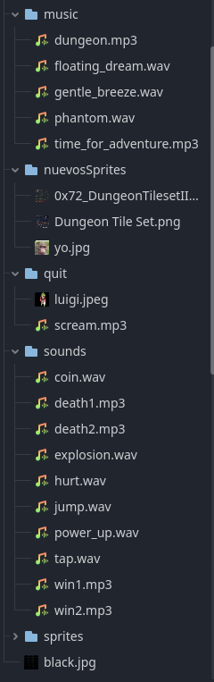

_-Imagen que lista todos los nuevos assets_

## Pinchos funcionales

Parece mentira que haga falta meter un apartado que sean _pinchos_, pero el trabajo que ha costado lo merece. 
1. Primero pensé en ponerle las colisiones de muerte como a los slimes. Luego pensé que tendría que hacerlo una escena y recubrir cada tile de pincho con eso. **Idea descartada**.
2. Segundo pensé que habría una forma de **activar colisiones específicas** y sí que lo hay, **de hecho está metida**, pero el método para poder usar las variables es con coordenadas específicas y requiere mucho tecnicismo. **Idea descartada**.
3. Al quedarme sin tiempo, por lo menos lo rellené las zonas de pinchos con slimes para hacerse pasar por pinchos. **Ahí fue la penúltima entrega, anoche.**
4. Tras relajarme un rato y _**pensar**_, saqué la conclusión definitiva: **Reutilizar la escena de la killzone y crear una colisión específica para cada zona con pinchos.** _Un poco trabajoso pero más que viable._ **¡Idea magnífica!**
    * Cuidado aquí porque como no estén bien separadas las colisiones de cada zona, puede que se líe y _se muevan todas las colisiones a la vez_. Esto suele pasar porque al hacer una duplicación o copia de un objeto, al mover el _padre_ (del que lo copias), mueve ese y todos los que hayas copiado de él. _Muy raro._

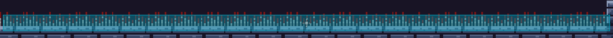

_-Imagen de la colisión de los pinchos_

___

## ¡Conexión remota!

Gracias a Docker y una página llamada _render.com_ he podido exportar mi proyecto para que sea jugable por otras personas. El día de mi presentación espero, si todo sale favorable, el poder abrir el enlace para que todos lo prueben. 

* Para que esta conexión sea posible, requiere un dockerfile con base en Nginx (ya que la exportación, lo que se abre es un _html_), acceso al repositorio público y que el contenedor esté encendido. 
  * Hay que tener cuidado con que se encienda en render un commit antiguo. **Es completamente necesario que el contenedor esté actualizado.**

Sólo me queda por añadir que es... **¡Compatible con todas las resoluciones!** _(Que he podido probar)_

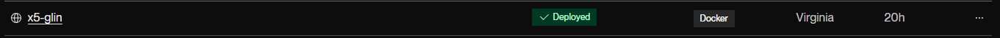

_-Imagen de lo que usa Docker_

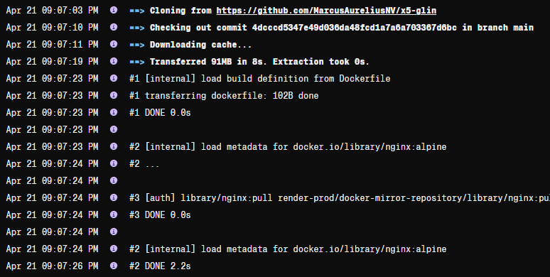

_-Imagen de lo que sale al iniciar el servidor de render (Sale mucho más pero eso es lo primero)_
___

 Con esto, creo que cubro todo lo que he estado haciendo en estas pocas semanas. Lleva bastante más trabajo del que uno se llega a imaginar.

 # Muchas gracias por leer y por la paciencia. ¡Espero que te guste la presentación!
